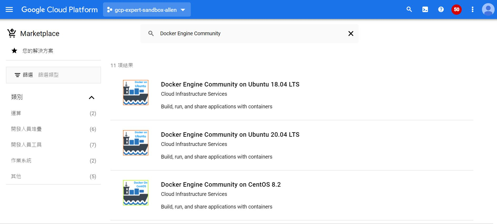

# Week 01 - docker 基礎1


### 基本概念

Docker 包括三個基本概念
- 映像檔（Image）
- 容器（Container）
- 倉庫（Repository）

### 安裝

##### 手動安裝

- Document(https://docs.docker.com/engine/install/#server)

- Install Docker 19.03+:
```
sudo dnf install -y yum-utils
sudo yum-config-manager \
    --add-repo \
    https://download.docker.com/linux/centos/docker-ce.repo
sudo dnf install -y docker-ce docker-ce-cli containerd.io
sudo systemctl start docker
```

- Verify you are now running version 19.03+:
```
sudo docker version
```

- Compare your output with the following example to ensure the Client and Server versions are 19.03+ :
```
Client: Docker Engine - Community
  Version:          19.03.13
  ...
Server: Docker Engine - Community
  Engine:
  Version:          19.03.13
```

##### 從 Marketplace 部署



### 映像檔


- Pull an image or a repository from a registry

```
docker pull 
```

- Search the Docker Hub for images

```
docker search
```

- List images

```
docker images
```

- Return low-level information on Docker objects

```
docker inspect
```
[example](image_metadata.json)

- Remove one or more images

```
docker rmi
```

```
docker rmi $(docker images -q)
```

- Save one or more images to a tar archive

```
docker save -o 
```

- Load an image from a tar archive

```
docker load -i
```

### 容器

- Run a command in a new container

```
docker run
```

```
docker run -d
```

```
docker run -d -p 80:80
```

```
docker run -d -v /some/content:/usr/share/nginx/html
```

```
docker run -d -e NGINX_PORT=80
```

- List containers

```
docker ps
```

```
docker ps -a
```

- Return low-level information on Docker objects

```
docker inspect
```

- Fetch the logs of a container

```
docker logs
```

```
docker logs -f
```

- Run a command in a running container

```
docker exec
```

```
docker exec -it  -- /bin/bash
```

- Stop one or more running containers

```
docker stop
```

- Start one or more stopped containers

```
docker start
```

- Restart one or more containers

```
docker restart
```

- Copy files/folders between a container and the local filesystem

```
docker cp
```

- Remove one or more containers

```
docker rm
```

```
docker rm $(docker ps -q)
```

### 倉庫

##### 公有倉庫

- Docker Hub: https://hub.docker.com/
- Quay: https://quay.io/

##### 私有倉庫

- Docker Registry: https://docs.docker.com/registry/
- Harbor: https://goharbor.io/docs/2.3.0/
  
  補充: [Harbor Installation](harbor.md)
- Artifact Registry: https://cloud.google.com/artifact-registry/docs/quickstarts

- Log in to a Docker registry

```
docker login
```

- Log out from a Docker registry

```
docker logout
```

- Create a tag TARGET_IMAGE that refers to SOURCE_IMAGE

```
docker tag
```

- Push an image or a repository to a registry

```
docker push
```

- register gcloud as a Docker credential helper

```
gcloud auth configure-docker
```

##### Docker Credential

Docker 將身份驗證設置保存在配置文件 config.json 中

- credHelpers

如果您使用 Docker 憑據幫助程序進行身份驗證，Container Registry 會將憑據幫助程序設置在credHelpers的部分

```
}
  "credHelpers": {
    "gcr.io": "gcloud",
    "us.gcr.io": "gcloud",
    "eu.gcr.io": "gcloud",
    "asia.gcr.io": "gcloud",
    "staging-k8s.gcr.io": "gcloud",
    "marketplace.gcr.io": "gcloud"
  }
}
```

- auths

如果您使用 Docker 使用令牌或服務帳戶密鑰作為密碼登錄，Docker 會在auths的部分中存儲base64 編碼的憑據

```
{
  "auths": {
    "harbor.example.com": {
      "auth": "YWRtaW46SGFyYm9yMTIzNDU="
    }
}    
```

- credStore

如果您配置了 憑證存儲 來管理憑證，則憑證存儲會設置credStore的部分

```
{
  "credsStore": "gcloud"
}
```

```
echo "https://gcr.io" | docker-credential-gcloud get
```


##### 推送鏡像到私有倉庫

- Harbor
- Artifact Registry