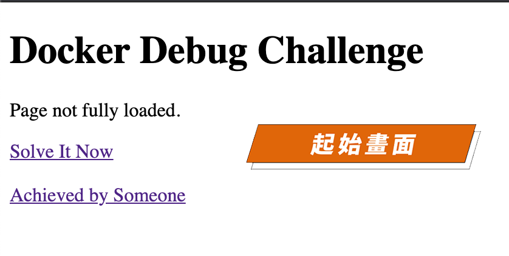
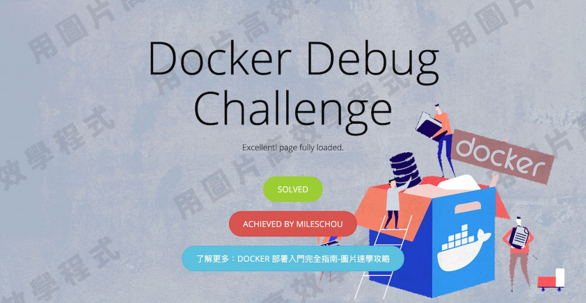

# Week 03 - docker 故障排除

Docker Debug 挑戰題

https://ithelp.ithome.com.tw/articles/10257226


### 建立環境

- 下載專案

```
git clone https://github.com/uopsdod/docker-debug-initial.git
```

- 下載圖片

```
cd docker-debug-initial
wget https://github.com/uopsdod/docker-debug-initial-image/blob/main/docker_debug_cover.jpeg
```

- 建立 dokcer image

```
docker build -t mywebsite --no-cache .
```

- 啟動 docker container

```
docker run --rm -p 80:80 --name mywebsite mywebsite
```

- 查看首頁畫面

http://\<ip\>




### 規則

僅能修改 Dockerfile

### 題目

- 30% 「Docker Debug Challenge」排版置中
- 10% 「Page Not Fully Loaded」警示字詞變成「Excellent! Page Fully Loaded」
- 10% 按鈕敘述：「Solve It Now」轉變成「Solved」
- 40% 呈現背景圖片
- 10% 按鈕敘述：ACHIEVED BY [放上自己名字]

### 成功畫面

