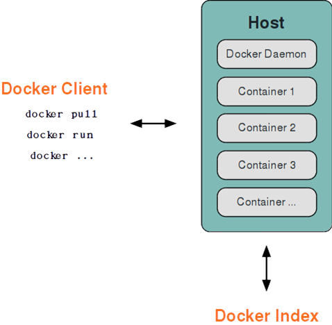
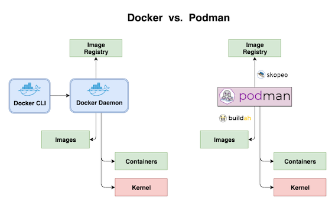

# Week 01 - container 進階

### docker

- Docker 採用了 C/S 架構，包括客戶端和服務端。 Docker daemon 作為服務端接受來自客戶的請求，並處理這些請求（建立、執行、分發容器）。 客戶端和服務端既可以執行在一個機器上，也可透過 socket 或者 RESTful API 來進行通信。

- Docker daemon 一般在宿主主機後臺執行，等待接收來自客戶端的消息。 Docker 客戶端則為使用者提供一系列可執行命令，使用者用這些命令實作跟 Docker daemon 互動。



### podman

- Podman 是一個開源的容器運行時項目，可在大多數 Linux 平台上使用。 Podman 提供與 Docker 非常相似的功能。正如前面提到的那樣，它不需要在你的系統上運行任何守護進程，並且它也可以在沒有 root 權限的情況下運行。

- Podman 可以管理和運行任何符合 OCI（Open Container Initiative）規範的容器和容器鏡像。 Podman 提供了一個與 Docker 兼容的命令行前端來管理 Docker 鏡像。

比較 |Docker |Podman
:---|:---|:---
來源 |OpenSource |RHEL ISO  
架構 |Client/Server |Fork/Exec
運行程序 |root 運行 |root/非root 運行
OCI |符合 OCI 標準 |符合 OCI 標準

##### Podman Installation

```
dnf install podman -y
```

##### Podman Command

https://www.mankier.com/1/podman#Commands

### skopeo

- Skopeo 是一個鏡像管理工具，允許我們通過 Push、Pull和復製鏡像來處理 Docker 和符合 OCI 規範的鏡像。

##### Skopeo Installation

```
dnf install skopeo -y
```

##### Skopeo Command

https://www.mankier.com/1/skopeo#Commands

### buildah

- 雖然 Podman 也可以支持用戶構建 Docker 鏡像，但是構建速度比較慢。並且默認情況下使用 VFS 存儲驅動程序會消耗大量磁盤空間。

- Buildah 是一個專注於構建 OCI 容器鏡像的工具，Buildah 構建速度非常快並使用覆蓋存儲驅動程序，可以節約大量的空間。

- Buildah 基於 fork-exec 模型，不以守護進程運行。 Buildah 支持 Dockerfile 中的所有命令。你可以直接使用 Dockerfiles 來構建鏡像，並且不需要任何 root 權限。 Buildah 也支持用自己的語法文件構建鏡像，可以允許將其他腳本語言集成到構建過程中。


##### Buildah Installation

```
dnf install buildah -y
```

##### Buildah Command

https://www.mankier.com/1/buildah#Commands

### Docker vs Podman



### docker-compose

Compose 是一個用於定義和運行多個 Docker 容器應用程序的工具。借助 Compose，您可以使用 YAML 文件來配置應用程序的服務。然後，使用單個命令，從配置中創建並啟動所有服務

使用 Compose 基本上是一個三步過程：

- 定義您的應用程序的映像檔

- 定義組成您的應用程序的服務，使用 **docker-compose.yml** 管理應用程序運行的組態。

- 運行 Docker compose 命令啟動並運行你的整個應用程序

- Docker Compose samples: https://github.com/docker/awesome-compose

[docker-compose.yml](docker-compose.yml)

##### Install Docker Compose

- Document: https://docs.docker.com/compose/install/#install-compose

- Run this command to download the current stable release of Docker Compose:

```
sudo curl -L "https://github.com/docker/compose/releases/download/1.29.2/docker-compose-$(uname -s)-$(uname -m)" -o /usr/local/bin/docker-compose
```

- Apply executable permissions to the binary:

```
sudo chmod +x /usr/local/bin/docker-compose
```

- Test the installation

```
docker-compose --version
```

##### Docker Compose file

schema |key |parameter |type |value |description
:---|:---|:---|:---|:---|:---
version | | | |
services | | | |
| |nginx | | | |service name 
| | |container_name |string |nginx |container name
| | |hostname |string |nginx |hostname
| | |image |string |docker.io/nginx:latest |image repo
| | |entrypoint |list |[ "/docker-entrypoint.sh" ] |entrypoint
| | |command |list |[ "nginx-debug", "-g", "daemon off;" ] |command
| | |environment |list or dict |[ "NGINX_PORT=80" ] |add environment variables
| | |ports |list |[ "80:80" ] |add port mappings
| | |network_mode |string |host |network mode
| | |extra_hosts |list |[ "database:162.242.195.82" ] |add hostname mappings
| | |dns |string or list |8.8.8.8 |add dns server
| | |dns_search |string or list |example.com |add search domain
| | |volumes |list |[ "vol:/usr/share/nginx/html",<dr> "./nginx.conf/etc/nginx/nginx.conf" ] |add volume mappings
| | |sysctls |list or dict |[ "net.core.somaxconn=1024",<dr> "net.ipv4.tcp_syncookies=0" ] |kernel parameters
| | |restart |string |always |restart policy
| | |depends_on |list |[ "memcache" ]|dependency between services
volumes | | |
| |vol | | | |volume name 
networks |
| |net | | | |network name

##### example

https://github.com/klin0024/uploader

### Using Podman and Docker Compose

- instruction: https://www.redhat.com/sysadmin/podman-docker-compose

- podman-docker: 使用 podman 模擬 Docker CLI，讓 Docker compose 可以藉由 podman-docker 介面，運行多的 Podman 容器
