# Week 05 - kubrenetes 基礎1

### Kubernetes Architecture

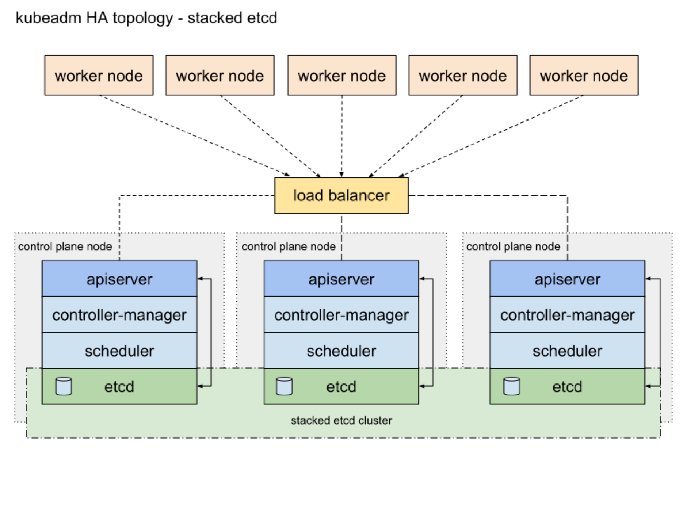

### Kubernetes Component

##### Master Node ( Control Plane )

- kube-apiserver

Kubernetes API服務器，Kubernetes 所有組件都是與Kubernetes API溝通，包括客戶端工具

- kube-scheduler

根據資源需求和政策，選擇並分配Pod所要運行的節點

- kube-controller-manager

負責管理並運行 Kubernetes 的控制組件，負責監視叢集程序狀態

- etcd

一致性和高可用性的鍵值資料庫，用於儲存Kubernetes的數據

##### Master Node & Worker Node

- kubelet

節點的管理員，負責管理該節點上的所有 Pods 的狀態並負責與 Kubernetes API溝通

- kube-proxy

節點的網路代理，允許從群集內部或外部的網路會話與Pod進行網路通信

- Container Runtime

負責運行容器的程式，Kubernetes 支持多種容器運行環境，包含 Docker、 containerd、CRI-O 以及任何實現 Kubernetes CRI的程式

### Kubernetes Resource

分類 |資源
:---|:---
Workload |Pod, HorizontalPodAutoscaler
Controller |ReplicaSet, ReplicationController, Deployment, StatefulSet, DaemonSet, Job, CronJob
Service Discovery |Service, Ingress
Authentication & Authorization |ServiceAccount, RBAC(Role, ClusterRole, RoleBinding, ClusterRoleBinding)
Storage |PersistentVolumeClaim, PersistentVolume, StorageClass, Secret, ConfigMap
Policy |NetworkPolicy, SecurityContext, ResourceQuota, LimitRange
Extension |CustomResourceDefinitions

### YAML

 YAML(YAML Ain't Markup Language，另一種標記語言)，但為了強調這種語言以資料做為中心，而不是以置標語言為重點，而用返璞詞重新命名。它是一種直觀的能夠被電腦識別的資料序列化格式，是一個可讀性高並且容易被人類閱讀，容易和指令碼語言互動，用來表達資料序列的程式語言

##### YAML的優勢

- YAML中沒有額外的定界符，所以比JSON/XML更輕量
- 沒有額外定界符，所以更易讀
- YAML使數據更容易理解，因此常用於配置文件中
- 應用廣泛，除配置文件之外，也應用於傳輸數據和中間存儲
- YAML是JSON 的超集，對於合法的JSON，同樣可以被YAML解析

##### YAML的不足

- 相對年輕，早期很多應用已經使用JONS/XML，對於開發者來說遷移至YAML成本是十分高
- 流行廣泛程度會影響應用生態，例如XML比YAML有更成熟的生態
- YAML使用縮排表示數據層級，因此處理時會相對複雜。性能上相對於XML和JSON會有差別
- 對於一些開發人員不擅長使用其複雜的縮排格式

|比較 |YAML |JSON |XML
:---|:---|:---|:---
程式語言 |Python |Javascript |Java
API |無 |REST |SOAP

###### 測驗

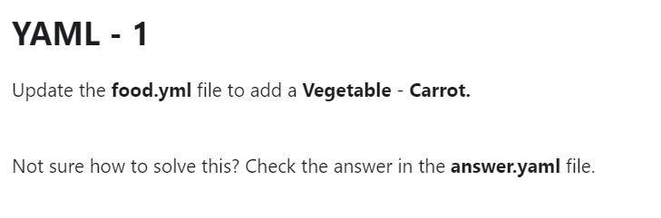

[Answer](YAML/exam01-answer.yml)

---

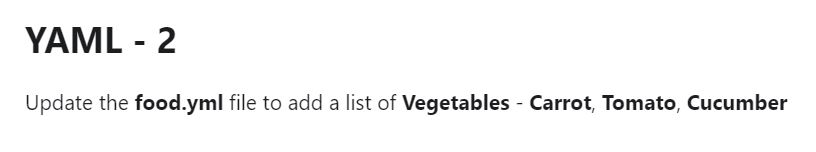

[Answer](YAML/exam02-answer.yml)

---

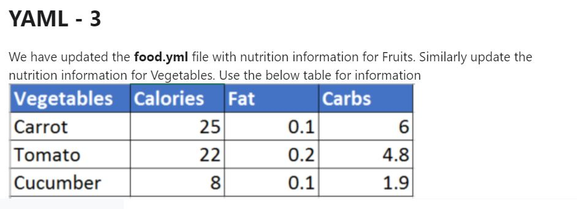

[Answer](YAML/exam03-answer.yml)

---

[Answer](YAML/exam04-answer.yml)

---

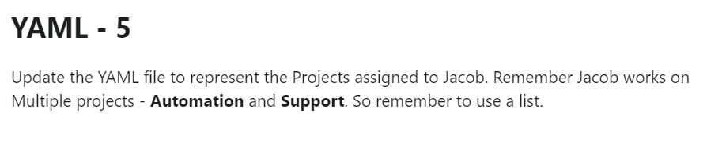

[Answer](YAML/exam05-answer.yml)

---

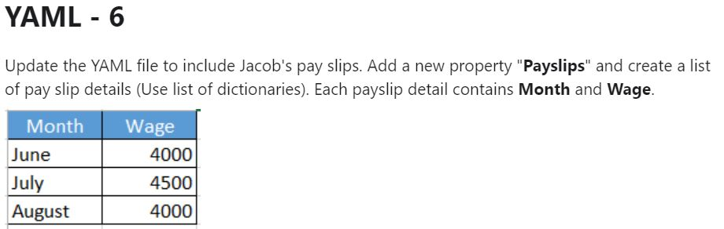

[Answer](YAML/exam06-answer.yml)

### NameSpace

- NameSpace是一種邏輯空間，每個NameSpace在邏輯上彼此分開，但具有相互通信的能力

- NameSpace適用於區隔團隊或專案的資源

- NameSpace不能相互嵌套，每個Kubernetes 資源只能在一個NameSpace中

### POD

- Pod是可以在Kubernetes中創建和管理的、最小的可部署單位

- Pod 是一組（一個或多個） 容器

- Pod 裡容器共享存儲、網路、以及怎樣運行這些容器的聲明，Pod 中的容器是並置的並且一同調度

- Pod 是特定於應用的“邏輯主機”，其中包含一個或多個應用容器， 這些容器是緊密耦合在一起的。類似於在同一邏輯主機上運行的應用程序

###### 測驗

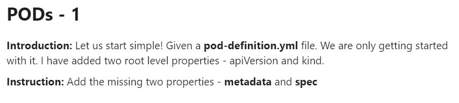

[Answer](POD/exam01-answer.yml)

---

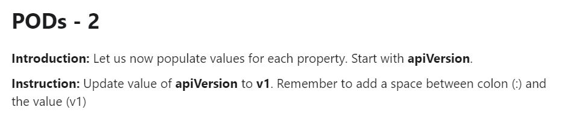

[Answer](POD/exam02-answer.yml)

---

[Answer](POD/exam03-answer.yml)

---

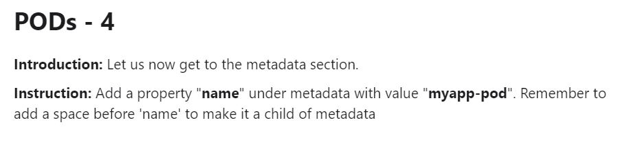

[Answer](POD/exam04-answer.yml)

---

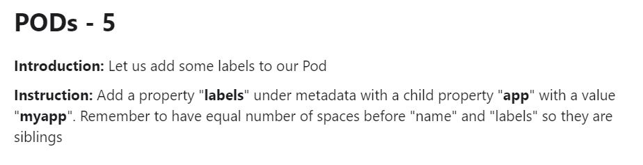

[Answer](POD/exam05-answer.yml)

---

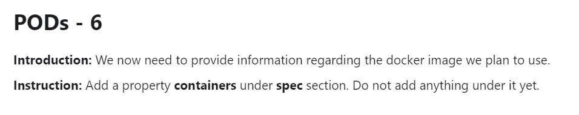

[Answer](POD/exam06-answer.yml)

---

[Answer](POD/exam07-answer.yml)

---

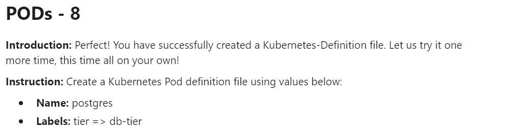

[Answer](POD/exam08-answer.yml)

---

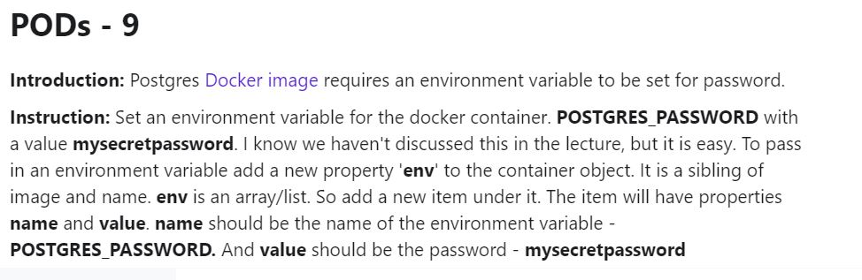

[Answer](POD/exam09-answer.yml)

### ReplicaSet

RepicaSet 是通過一組字段來定義的，包括一個用來識別可獲得的 Pod 的集合的選擇算符、一個用來標明應該維護的副本個數的數值、一個用來指定應該創建新 Pod 以滿足副本個數條件時要使用的 Pod 模板等等。每個 ReplicaSet 都通過根據需要創建和 刪除 Pod 以使得副本個數達到期望值， 進而實現其存在價值。當 ReplicaSet 需要創建新的 Pod 時，會使用所提供的 Pod 模板。

###### 測驗

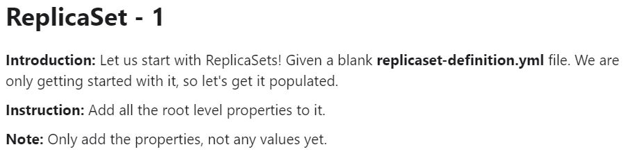

[Answer](ReplicaSet/exam01-answer.yml)

---

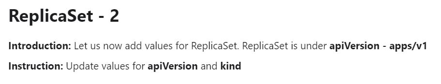

[Answer](ReplicaSet/exam02-answer.yml)

---

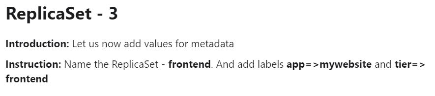

[Answer](ReplicaSet/exam03-answer.yml)

---

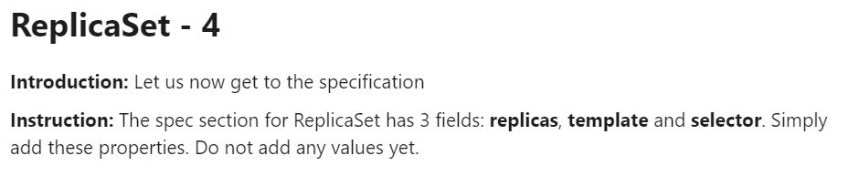

[Answer](ReplicaSet/exam04-answer.yml)

---

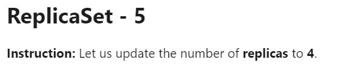

[Answer](ReplicaSet/exam05-answer.yml)

---

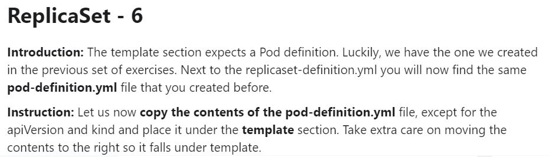

[Answer](ReplicaSet/exam06-answer.yml)

---

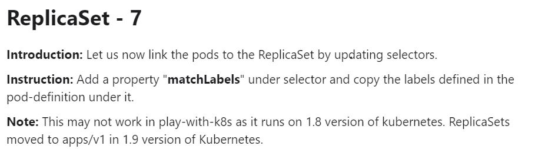

[Answer](ReplicaSet/exam07-answer.yml)

### Deployment

- Deployment為聲明Pod的複製數量

- Deployment負責新增，修改，刪除，Pod的內容及數量，也支援回滾到任一版本

- Deployment也會自動替換任何失敗或無響應的Pod
確保您的應用程序會保持一個或多個可用的服務，滿足用戶的請求

- Deployment -> ReplicaSet -> Pod

###### 測驗

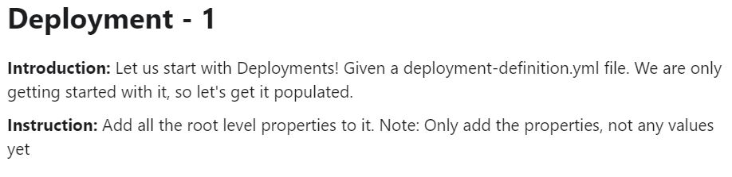

[Answer](Deployment/exam01-answer.yml)

---

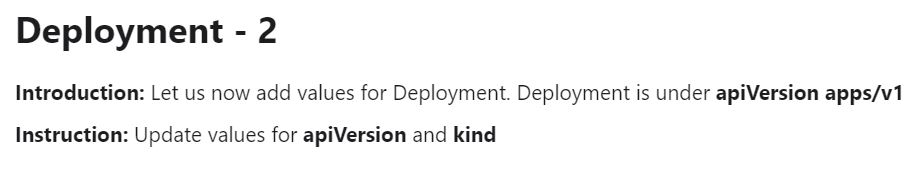

[Answer](Deployment/exam02-answer.yml)

---

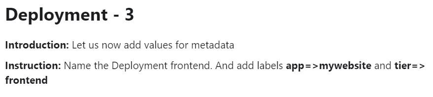

[Answer](Deployment/exam03-answer.yml)

---

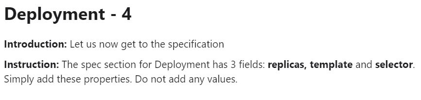

[Answer](Deployment/exam04-answer.yml)

---

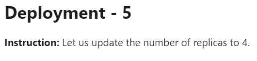

[Answer](Deployment/exam05-answer.yml)

---

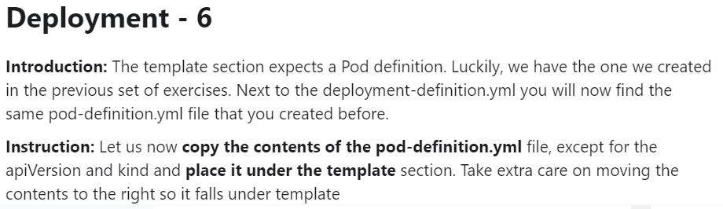

[Answer](Deployment/exam06-answer.yml)

---

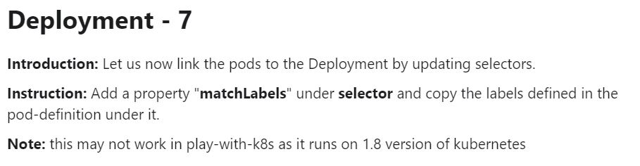

[Answer](Deployment/exam07-answer.yml)

### StatefulSet

- StatefulSet 是用來管理有狀態的工作負載， 並為這些Pod提供持久存儲和持久名稱

- StatefulSets 適用於滿足以下一個或多個需求的應用程序：
  - 持久的名稱
  - 持久的存儲
  - 部署和縮放
  - 自動的滾動更新

### DaemonSet

- DaemonSet確保在節點上運行一個Pod的副本。當有節點加入集群時，也會為他們新增一個Pod 。當有節點從集群移除時，這些Pod也會被回收

- 刪除DaemonSet將會刪除它創建的所有Pod

- DaemonSet 的用法：
  - 在每個節點上運行日誌收集守護進程
  - 在每個節點上運行監控守護進程

### Job

- Job將創建一個或多個Pod，並將繼續重試執行Pod，直到成功完成指定數量的工作

- 例如創建一個Job，便會運行一個Pod來完成。如果第一個Pod發生故障或被刪除（例如，由於節點硬件故障或節點重啟），則Job對象將啟動一個新的Pod來完成工作

### CronJob

- CronJob創建一個排程，按照重複的時間表執行Job

- CronJob就像是linux上的crontab。它以Cron格式按給定的時間表定期運行工作

- 範例:
  - */15  *  *  *  *  每15分鐘執行1次
  - 0  12  *  *  *    每日12點執行
