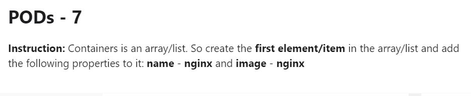

# Week 05 - kubrenetes 基礎1

### YAML

###### 測驗

[Answer](YAML/exam01-answer.yml)

---

[Answer](YAML/exam02-answer.yml)

---

[Answer](YAML/exam03-answer.yml)

---

[Answer](YAML/exam04-answer.yml)

---

[Answer](YAML/exam05-answer.yml)

---

[Answer](YAML/exam06-answer.yml)

### POD

###### 測驗

[Answer](POD/exam01-answer.yml)

---

[Answer](POD/exam02-answer.yml)

---

[Answer](POD/exam03-answer.yml)

---

[Answer](POD/exam04-answer.yml)

---

[Answer](POD/exam05-answer.yml)

---

[Answer](POD/exam06-answer.yml)

---

[Answer](POD/exam07-answer.yml)

---

[Answer](POD/exam08-answer.yml)

---

[Answer](POD/exam09-answer.yml)

### ReplicaSet

###### 測驗

[Answer](ReplicaSet/exam01-answer.yml)

---

[Answer](ReplicaSet/exam02-answer.yml)

---

[Answer](ReplicaSet/exam03-answer.yml)

---

[Answer](ReplicaSet/exam04-answer.yml)

---

[Answer](ReplicaSet/exam05-answer.yml)

---

[Answer](ReplicaSet/exam06-answer.yml)

---

[Answer](ReplicaSet/exam07-answer.yml)

### Deployment

###### 測驗

[Answer](Deployment/exam01-answer.yml)

---

[Answer](Deployment/exam02-answer.yml)

---

[Answer](Deployment/exam03-answer.yml)

---

[Answer](Deployment/exam04-answer.yml)

---

[Answer](Deployment/exam05-answer.yml)

---

[Answer](Deployment/exam06-answer.yml)

---

[Answer](Deployment/exam07-answer.yml)

