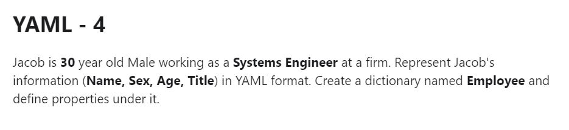
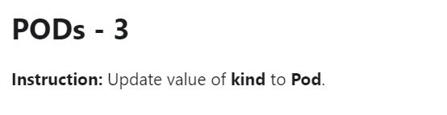

# Week 05 - kubrenetes 基礎1

### Kubernetes Architecture

### Kubernetes Component

##### Master Node ( Control Plane)

- kube-apiserver

Kubernetes API服務器，Kubernetes 所有組件都是與Kubernetes API溝通，包括客戶端工具

- kube-scheduler

根據資源需求和政策，選擇並分配Pod所要運行的節點

- kube-controller-manager

負責管理並運行 Kubernetes 的控制組件，負責監視叢集程序狀態

- etcd

一致性和高可用性的鍵值資料庫，用於儲存Kubernetes的數據

##### Worker Node

- kubelet

節點的管理員，負責管理該節點上的所有 Pods 的狀態並負責與 Kubernetes API溝通

- kube-proxy

節點的網路代理，允許從群集內部或外部的網路會話與Pod進行網路通信

- Container Runtime

負責運行容器的程式，Kubernetes 支持多種容器運行環境，包含 Docker、 containerd、CRI-O 以及任何實現 Kubernetes CRI的程式

### Kubernetes Resource

分類 |資源
:---|:---
Workload |Pod, HorizontalPodAutoscaler
Controller |ReplicaSet, ReplicationController, Deployment, StatefulSet, DaemonSet, Job, CronJob
Service Discovery |Service, Ingress
Authentication & Authorization |ServiceAccount, RBAC(Role, ClusterRole, RoleBinding, ClusterRoleBinding)
Storage |PersistentVolumeClaim, PersistentVolume, StorageClass, Secret, ConfigMap
Policy |NetworkPolicy, SecurityContext, ResourceQuota, LimitRange
Extension |CustomResourceDefinitions

### YAML

###### 測驗

[Answer](YAML/exam01-answer.yml)

---

[Answer](YAML/exam02-answer.yml)

---

[Answer](YAML/exam03-answer.yml)

---

[Answer](YAML/exam04-answer.yml)

---

[Answer](YAML/exam05-answer.yml)

---

[Answer](YAML/exam06-answer.yml)

### POD

###### 測驗

[Answer](POD/exam01-answer.yml)

---

[Answer](POD/exam02-answer.yml)

---

[Answer](POD/exam03-answer.yml)

---

[Answer](POD/exam04-answer.yml)

---

[Answer](POD/exam05-answer.yml)

---

[Answer](POD/exam06-answer.yml)

---

[Answer](POD/exam07-answer.yml)

---

[Answer](POD/exam08-answer.yml)

---

[Answer](POD/exam09-answer.yml)

### ReplicaSet

###### 測驗

[Answer](ReplicaSet/exam01-answer.yml)

---

[Answer](ReplicaSet/exam02-answer.yml)

---

[Answer](ReplicaSet/exam03-answer.yml)

---

[Answer](ReplicaSet/exam04-answer.yml)

---

[Answer](ReplicaSet/exam05-answer.yml)

---

[Answer](ReplicaSet/exam06-answer.yml)

---

[Answer](ReplicaSet/exam07-answer.yml)

### Deployment

###### 測驗

[Answer](Deployment/exam01-answer.yml)

---

[Answer](Deployment/exam02-answer.yml)

---

[Answer](Deployment/exam03-answer.yml)

---

[Answer](Deployment/exam04-answer.yml)

---

[Answer](Deployment/exam05-answer.yml)

---

[Answer](Deployment/exam06-answer.yml)

---

[Answer](Deployment/exam07-answer.yml)

