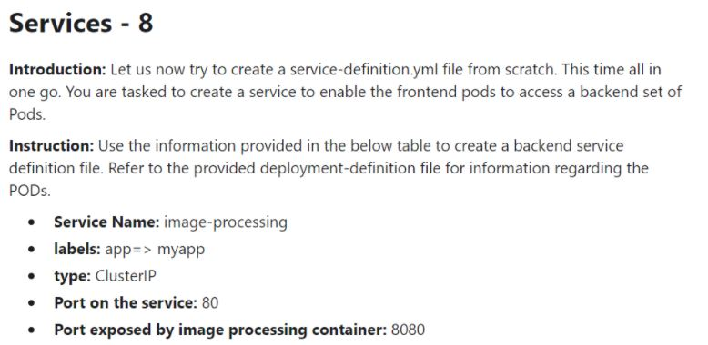

# Week 06 - kubrenetes 基礎2

### Service

- 定義了邏輯上的一群 Pod 以及如何存取他們的規則

- Kubernetes為Pod提供自己的IP地址和一組Pod的單個DNS名稱，但是Pod的IP和DNS名稱並不固定，所以需要Service在它們之間進行負載平衡，Service會提供固定的IP和DNS名稱

##### ClusterIP

##### NodePort

##### LoadBalancer

##### Headless

比較 |ClusterIP |NodePort |LoadBalancer |Headless
:---|:---|:---|:---|:---
對外 |N |Y |Y |N

###### 測驗

[Answer](Service/exam01-answer.yml)

---

[Answer](Service/exam02-answer.yml)

---

[Answer](Service/exam03-answer.yml)

---

[Answer](Service/exam04-answer.yml)

---

[Answer](Service/exam05-answer.yml)

---

[Answer](Service/exam06-answer.yml)

---

[Answer](Service/exam07-answer.yml)

---

[Answer](Service/exam08-answer.yml)

### Ingress

- Ingress公開了從群集外部到群集內服務的HTTP和HTTPS反向代理服務

- 流量路由由Ingress資源上定義的規則控制，可以定義多個路由規則

- 可以將Ingress配置為提供服務外部可訪問的URL，作為負載平衡的入口，並將SSL綁定在Ingress的入口上

### ServiceAccount

### RBAC

##### role

##### ClusterRole

##### RoleBinding

##### ClusterRoleBinding

### PersistentVolumeClaim

### PersistentVolume

### StorageClass

### Secret

### ConfigMap

### NetworkPolicy

### ResourceQuota

### LimitRange
