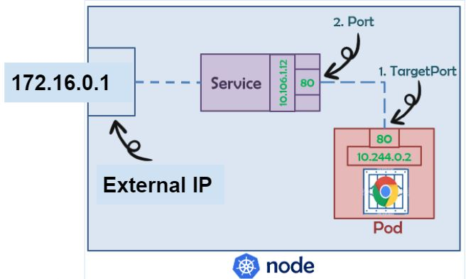
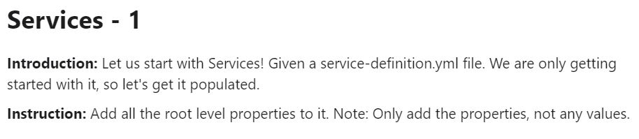
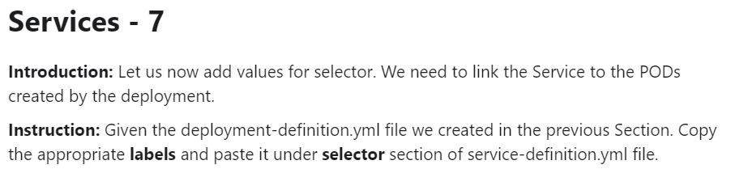
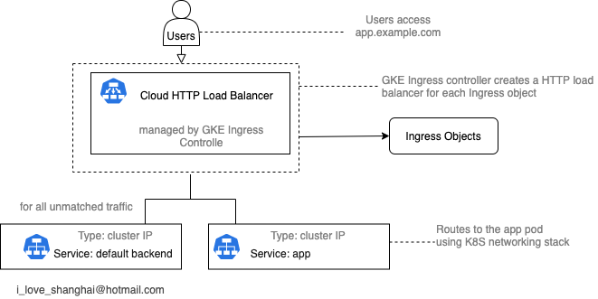
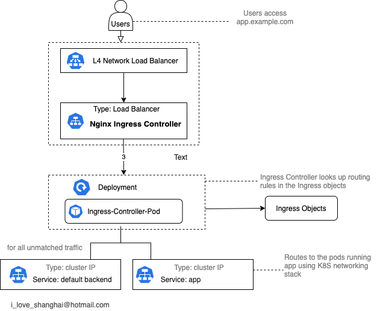
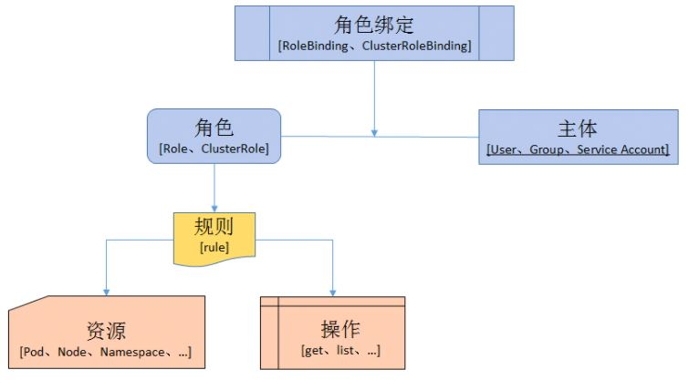

# Week 06 - kubrenetes 基礎2


### Service

- 定義了邏輯上的一群 Pod 以及如何存取他們的規則

- Kubernetes為Pod提供自己的IP地址和一組Pod的單個DNS名稱，但是Pod的IP和DNS名稱並不固定，所以需要Service在它們之間進行負載平衡，Service會提供固定的IP和DNS名稱

##### ClusterIP


##### NodePort


##### LoadBalancer



##### Headless


比較 |ClusterIP |NodePort |LoadBalancer |Headless
:---|:---|:---|:---|:---
對外 |N |Y |Y |N


###### 測驗



[Answer](Service/exam01-answer.yml)

---


[Answer](Service/exam02-answer.yml)

---


[Answer](Service/exam03-answer.yml)

---


[Answer](Service/exam04-answer.yml)

---


[Answer](Service/exam05-answer.yml)

---


[Answer](Service/exam06-answer.yml)

---



[Answer](Service/exam07-answer.yml)


---


[Answer](Service/exam08-answer.yml)

### Ingress


- Ingress公開了從群集外部到群集內服務的HTTP和HTTPS反向代理服務

- 流量路由由Ingress資源上定義的規則控制，可以定義多個路由規則

- 可以將Ingress配置為提供服務外部可訪問的URL，作為負載平衡的入口，並將SSL綁定在Ingress的入口上

- Ingress 有2個要素
  - Ingress Object: 一個靜態定義yaml,包含路由規則集合
  - Ingress Controller: 讀取Ingress object 並實際處理路由規則的應用程序或程序

- Ingress controller的運行方式各不相同。通常有兩種模式
  - Load Balancer Mode: 控制器與外部HTTP LB一起工作, 如: GKE Ingress Controller, F5 BIG-IP
  - Proxy Mode: 控制器為節點上運行的 pod/deployment，並將自身作為服務暴露在外部, 如: Nginx Ingress Controller, Istio Ingress Gateway

##### GKE Ingress



```
apiVersion: networking.k8s.io/v1beta1
kind: Ingress
metadata:
  annotations:
    kubernetes.io/ingress.class: gce
  name: gke-ingress
  namespace: ingress-nginx
spec:
  backend:
    serviceName: ingress-nginx-controller
    servicePort: 80
```

##### Nginx Ingress



```
apiVersion: networking.k8s.io/v1beta1
kind: Ingress
metadata:
  annotations:
    kubernetes.io/ingress.class: nginx
  name: ingress
spec:
  rules:
  - host: demos.exaple.com
    http:
      paths:
      - backend:
          service:
            name: nginx
            port:
              number: 80   
```  

### ServiceAccount

- ServiceAccount (SA)是為了方便Pod 裡面的進程調用Kubernetes API 或其他外部服務而設計

- 每個SA會創建一個Token，透過Token可以存取相應權限在Kubernetes的資源

### RBAC



##### Role & ClusterRole

- Role或ClusterRole包含代表一組權限，權限是累加的（沒有拒絕規則）

- 如果要在命名空間中定義角色，請使用Role

- 如果要在群集範圍內定義角色，請使用ClusterRole

##### RoleBinding & ClusterRoleBinding

- RoleBinding或ClusterRoleBinding是授予群組或服務帳戶在角色中定義的權限

- RoleBinding可以引用同一命名空間中的任何Role，也可以引用ClusterRole，並將該ClusterRole綁定到群組或服務帳戶

- ClusterRoleBinding是將ClusterRole綁定到群集中的所有命名空間

### PersistentVolumeClaim

- PersistentVolumeClaim（PVC）是由用戶進行存儲的請求

- PVC 會聲明可以請求特定的大小和訪問模式（例如，訪問模式為ReadWriteOnce，ReadOnlyMany或ReadWriteMany）

- 一個PVC資源只會綁定一個PV資源

### PersistentVolume

- PersistentVolume（PV）是一個持久卷，實際資料放置的位置，支援多種儲存裝置，如，NFS，iSCSI，gcePersistentDisk，NetApp

- PV 可以由集群管理員靜態創建，也可以由Kubernetes API服務器動態創建

- 動態創建需配合StorageClass (SC)，聲明PV 所用的儲存空間


### StorageClass

- StorageClass (SC)為管理員提供了一種描述儲存類別的方法

- 不同的類別對應不同儲存裝置，如，HDD，SSD，提供不同的儲存類型

- PVC聲明使用哪種SC，Kubernetes API服務器會動態創建相應的PV


### Secret

- Secret可讓您存儲和管理敏感信息，例如密碼，OAuth令牌和ssh密鑰

- Secret與ConfigMap用法一致，差別是一個是存儲機敏數據，一個是存儲一般數據


### ConfigMap

- ConfigMap (CM)是用於非機密數據存儲

- Pod可以將CM用作環境變量，命令行參數或配置文件中的靜態文件

- CM允許您將容器環境的配置與您的應用程式進行解耦，方便您的應用程序進行移植

### NetworkPolicy

- NetworkPolicy 用於管理Pod進去或出去的網路流量

- NetworkPolicy 通過以下 3 個標識符的組合來標識：
  - 允許的其他 Pod
  - 允許的NameSpace
  - 允許的IP 地址

### ResourceQuota

- ResourceQuota (QUOTA)定義的資源配額，限制每個命名空間使用的總資源數量

- QUOTA可以按類型限制可在命名空間中創建的資源數量，以及該命名空間中的資源可能消耗的計算資源總量


### LimitRange

- 默認情況下，容器在Kubernetes集群上是無限制計算資源(CPU和Memory)的使用

- LimitRange用於限制Pod或Container資源消耗及要求的最低資源

