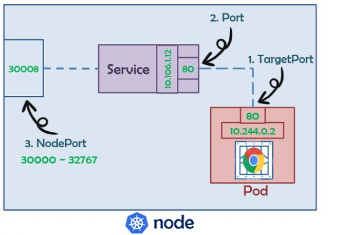
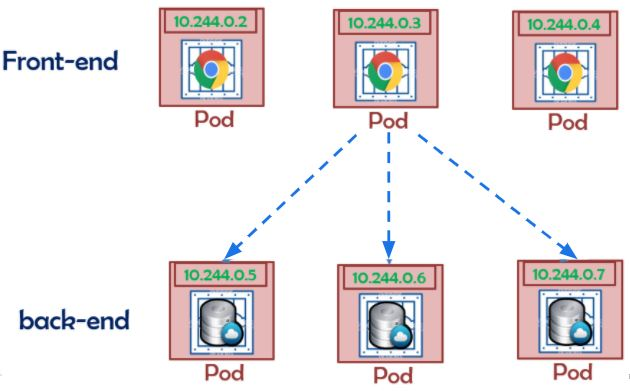
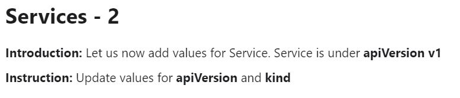
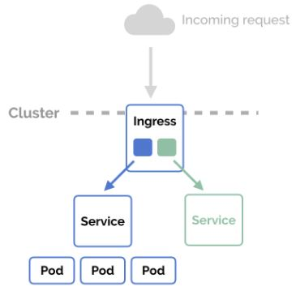

# Week 06 - kubrenetes 基礎2

### Service

- 定義了邏輯上的一群 Pod 以及如何存取他們的規則

- Kubernetes為Pod提供自己的IP地址和一組Pod的單個DNS名稱，但是Pod的IP和DNS名稱並不固定，所以需要Service在它們之間進行負載平衡，Service會提供固定的IP和DNS名稱

##### ClusterIP

##### NodePort

##### LoadBalancer

##### Headless

比較 |ClusterIP |NodePort |LoadBalancer |Headless
:---|:---|:---|:---|:---
對外 |N |Y |Y |N

###### 測驗

[Answer](Service/exam01-answer.yml)

---

[Answer](Service/exam02-answer.yml)

---

[Answer](Service/exam03-answer.yml)

---

[Answer](Service/exam04-answer.yml)

---

[Answer](Service/exam05-answer.yml)

---

[Answer](Service/exam06-answer.yml)

---

[Answer](Service/exam07-answer.yml)

---

[Answer](Service/exam08-answer.yml)

### Ingress

- Ingress公開了從群集外部到群集內服務的HTTP和HTTPS反向代理服務

- 流量路由由Ingress資源上定義的規則控制，可以定義多個路由規則

- 可以將Ingress配置為提供服務外部可訪問的URL，作為負載平衡的入口，並將SSL綁定在Ingress的入口上

### ServiceAccount

- ServiceAccount 是為了方便Pod 裡面的進程調用Kubernetes API 或其他外部服務而設計

- 每個ServiceAccount 會創建一個Token，透過Token可以存取相應權限在Kubernetes的資源

### RBAC

##### Role & ClusterRole

- Role或ClusterRole包含代表一組權限，權限是累加的（沒有拒絕規則）

- 如果要在命名空間中定義角色，請使用Role
- 如果要在群集範圍內定義角色，請使用ClusterRole

##### RoleBinding & ClusterRoleBinding

- RoleBinding或ClusterRoleBinding是授予群組或服務帳戶在角色中定義的權限

- RoleBinding可以引用同一命名空間中的任何Role，也可以引用ClusterRole，並將該ClusterRole綁定到群組或服務帳戶

- ClusterRoleBinding是將ClusterRole綁定到群集中的所有命名空間

### PersistentVolumeClaim

- PersistentVolumeClaim（PVC）是由用戶進行存儲的請求

- PVC 會聲明可以請求特定的大小和訪問模式（例如，訪問模式為ReadWriteOnce，ReadOnlyMany或ReadWriteMany）

- 一個PVC資源只會綁定一個PV資源

### PersistentVolume

- PersistentVolume（PV）是一個持久卷，實際資料放置的位置，支援多種儲存裝置，如，NFS，iSCSI，gcePersistentDisk，NetApp

- PV 可以由集群管理員靜態創建，也可以由Kubernetes API服務器動態創建

- 動態創建需配合StorageClass (SC)，聲明PV 所用的儲存空間

### StorageClass

- StorageClass (SC)為管理員提供了一種描述儲存類別的方法

- 不同的類別對應不同儲存裝置，如，HDD，SSD，提供不同的儲存類型

- PVC聲明使用哪種SC，Kubernetes API服務器會動態創建相應的PV

### Secret

### ConfigMap

### NetworkPolicy

### ResourceQuota

### LimitRange
